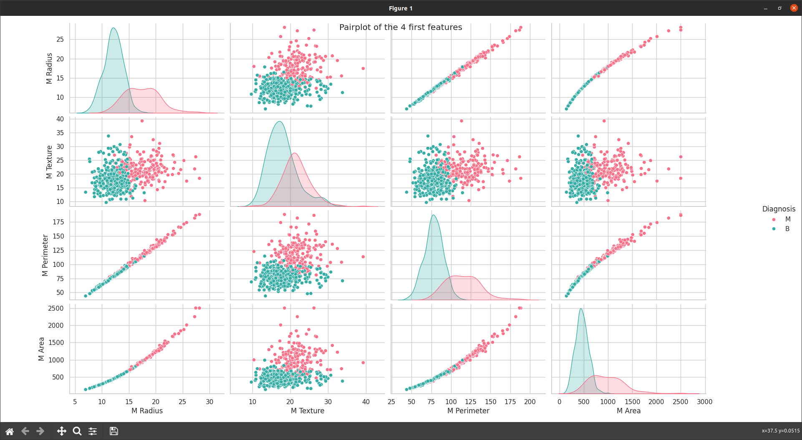

# Data analysis

## Mean features (features starting by M)

With the first one we can erase the features : 'M Perimeter' and 'M Area' because they are linearly dependent of 'M Radius'.

With the second one we can erase the features : 'M Smoothness', 'M Symmetry' and 'M Fractal Dim' because they are similar for Malignant case and Benign case.

So we keep the Mean features : 'M Radius', 'M Texture', 'M Compactness', 'M Concavity' and 'M Concave Points'.

## Standard Error features (features starting by SE)

No dependent features this time, we can erase 'SE Texture', 'SE Smoothness', 'SE Symmetry' and 'SE Fractal Dim' because they are similar for Malignant case and Benign case.

So we keep the Standard Error features : 'SE Radius', 'SE Perimeter', 'SE Area', 'SE Compactness', 'SE Concavity' and 'SE Concave Points',

## Worst features (features starting by W)

We can erase the depend features 'W Perimeter', 'W Area'.

We can erase the features : 'W Symmetry', 'W Fractal Dim', because they are similar for Malignant case and Benign case.

So we keep the Worst features : 'W Radius', 'W Texture', 'W Smoothness', 'W Compactness', 'W Concavity' and 'W Concave Points'.

## Filter data
Filter out the selected features  and the diagnosis into "filter_data.csv".